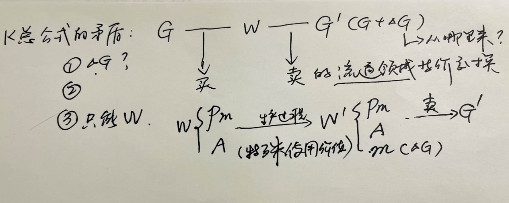
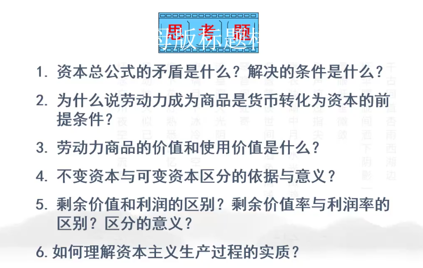

# 2022.06.06. 马原期末总复习

## 上课

## 总复习

### 导言

什么是马克思主义

历史（怎么产生的）

怎么学习、怎么对待（辩证法，又要发展，又要继承）

### 第一章 世界的物质性及发展规律

世界的本源

辩证唯物主义

马克思主义看待世界、分析世界根本问题的方法就是辩证法

要点：

1. 成对出现的矛盾（物质和意识间的辩证关系）
2. 哲学的基本问题（书面作业），要展开来好好复习
3. 列宁提出的物质范畴
4. 发展的实质就是新事物战胜旧事物
5. 矛盾理论是整个唯物辩证法的理论核心
6. 主次矛盾的转化（如何理解，如何转化的）
7. 质变和量变的辩证关系：注意把握适度原则

### 第二章

实践和认识（马克思：实践第一）

唯物论与唯心论的认识路线、代表人物及观点

感性认识和理性认识之间的辩证关系

教条主义和其他的错误

复习过程中做题，5～10套

真理：客观性、相对性、绝对性（一定要好好琢磨）

100页的教学要点

地理环境决定论，环境问题，生产文明建设（社会存在与社会意识间的）

社会矛盾：社会主要矛盾的问题

人的主观能动性和规律的客观性间的问题

引起重视（思想观点）：人民群众的观念（人民群众创造历史） -> 以人民为中心的思想

### 第四章

劳动价值论（偏重）、剩余价值论

具体劳动、抽象劳动的关系：劳动二重性

剩余价值理论

学习通上有大量资源，比如马原的精品课展示，全国自学考试题，研究生考题

单选、判断、简答、材料分析、论述
